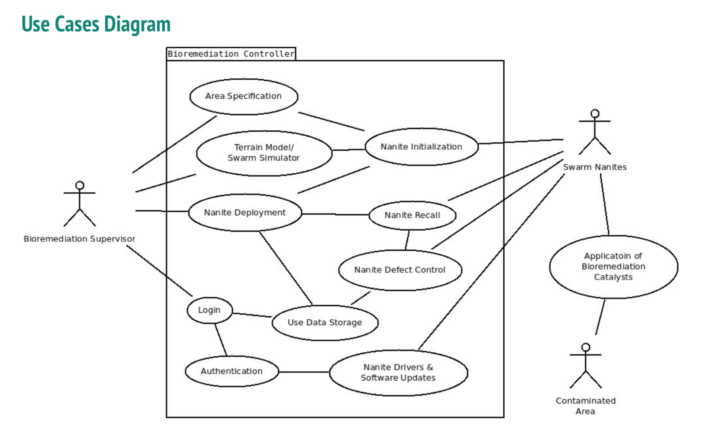
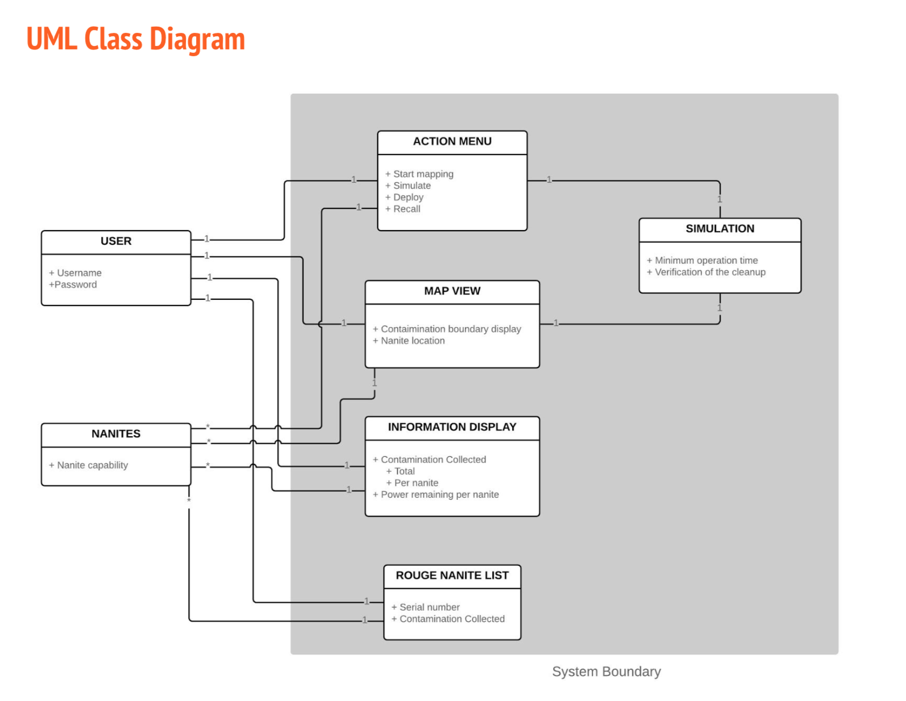
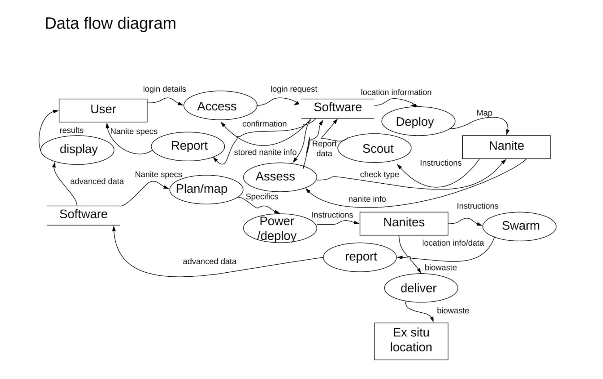
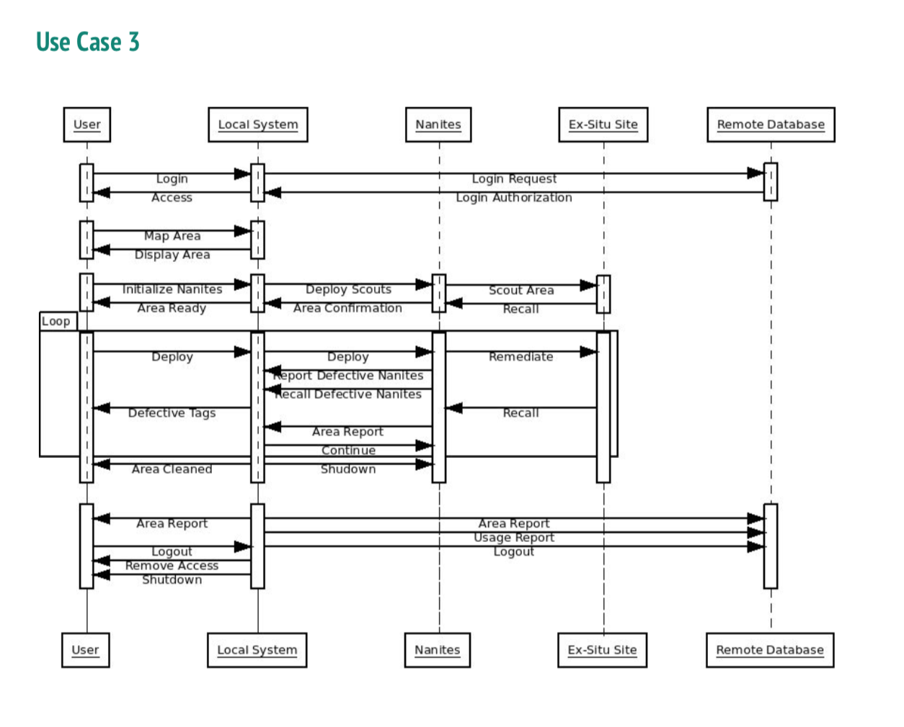

# HW 1 (team): Requirements Assignment

- Deadline: `Apr 21 at 11:59pm`

- The page estimates above total approximately 10 pages, but you may turn in up to 15 pages at your discretion.

***

## Requirements	definition

- [ ] Functional requirements and non-functional requirements in terms of **the environment**. (1 page)

```
Functional Requirement

● The system shall authenticate the user’s credentials before use.
● The system shall display a list of the nanites’ capability.
● The system shall display the contamination boundary on a Google Map type view.

Non-functional Requirement

● The system shall authenticate the user within 20 seconds.
● The system shall deploy the nanites within 1 minute of user interaction.
● The system shall display the location of each nanite from within the last 5 seconds.
```

---

- [ ] Structured descriptions of the most important **3 use cases**. (3 pages)

```
Use Case 1
● Oil Spill Cleanup 

Actors
● USCG Oil Spill Rescue Engineer

Preconditions
● User is in location of oil spill.

Postconditions
● Defective nanites have been identified and tagged.

Flow of Events
● Authorization: User gains authorized access to the software controlling the nanites.
● Power up: User uses the software to power on the nanites.
...

```



---

- [ ] **UML class diagram** or **ERD** showing the important entities (and their attributes) in the environment where the system will execute. (1 pgae)




---

## Requirements	specification

- [ ] Functional requirements and non-functional requirements in terms of the **system's interfaces** (1 page)

```
Functional Requirements
● User details will be checked against information stored on the software’s database.
● The software will detect nanites’ capabilities, and parse and send that data to the
user interface.
● The system will receive nanite location/other data and display that to the user.

Non-functional Requirements
● The system will query the database and return a response of user authentication in less than 20 seconds.
● The system will run deploy protocols and power nanites in less than one minute.
● The system will update nanite data at least every 5 seconds.
```

---

- [ ] **Dataflow diagram** showing how the system relates to entities in the environment (1 page)



---

- [ ] **Message sequence charts**, or **state charts**, for the most important 3 use cases (3 pages)



---

- [ ] Customer Meeting Summary

In one sentence, briefly summarize whether your customer was willing and able to meet with you on Tuesday or Wednesday.

---

- [ ] Team Member Contributions

Briefly summarize the contribution of each of your team members

***

## Schedule

### 4.14 (Sun.)

- Meet as an entire team with the **customer** to ask questions about aspects of the Vision Statement that puzzle you.

### 4.15 (Mon.)

- 2 team members write up "Functional requirements and non-functional requirements in terms of **the environment**".

- 3 team members each write up **one use case**. Send these results to the rest of the team.

### 4.16 (Tue.)

- //TODO

### 4.17 (Wed.)

- Team members meet to read the use cases. Together, identify the **key entities** in the environment. 

- 2 people draws the **UML class diagram** (or ERD).

- The other team members draws the **dataflow diagram**.

### 4.18 (Thu.)

- 2 team members write up "Functional requirements and non-functional requirements in terms of the **system's interfaces**".

### 4.19 (Fri.)

- 3 Team members each write up a sequence or state chart for their respective use case

### 4.20 (Sat.)

- 2 team members edits all of the documents together so that they are consistent

### 4.21 (Sun.)

- //TODO

***

## Work 

- User Cases + Message sequence charts : _____ _____ _____

- Requirements (in environment and system's interfaces): _____ _____

- UML Class Diagram _____ _____

- Dataflow Diagram _____ _____ _____

- Window to our customer _____

- edits all of the documents and generate Google docs _____ _____